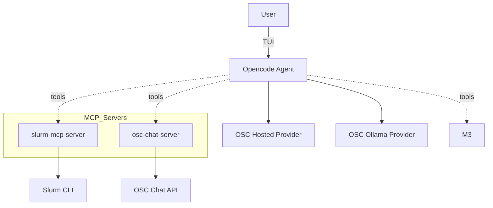

<p align="center">
  
</p>


This directory contains the OSC deployment of hpcGPT. It integrates Model Context Protocol (MCP) servers for Slurm-based HPC environment and OSC Chat documentation Q&A.

## TL;DR - Getting Started

```bash
curl -fsSL https://opencode.ai/install | bash
export OPENCODE_CONFIG=/absolute/path/to/this/repo/OSC/opencode.jsonc
opencode
```

Set environment variables as needed (see Env section below), then pick a model and use tools from the TUI.

## Features

- Slurm integration (MCP): `accounts`, `sinfo`, `squeue`, and `scontrol` via `slurm-mcp-server`.
- Docs Q&A (MCP): OSC Chat tools `query_osc_documentation`.
- Provider setup: OSC Hosted provider configured in `opencode.jsonc`.
- Config-driven: Everything wired through `opencode.jsonc` for reproducibility.

## System Architecture



### How things fit together

- Opencode reads `OSC/opencode.jsonc` for providers, models, and MCP servers.
- MCP servers expose tools over stdio; the agent calls them when the model chooses a tool.
- `slurm-mcp-server` shells out to local Slurm commands.
- `osc-chat-server` calls the OSC Chat API to answer questions from OSC docs.

## Project Structure

```text
OSC/
  mcp_servers/
    osc_chat_server/
      server.py
      requirements.txt
    slurm_server/
      server.py
      requirements.txt
  prompts/
    support.txt
    report.txt
  opencode.jsonc
  example.env
  doc-scraping/
  README.md
```

## MCP Servers & Tools

- slurm-mcp (local)
  - Tools: `accounts`, `sinfo`, `squeue`, `scontrol`
  - Purpose: query accounts, node/partition status, user jobs, and job details.

- osc-chat-mcp (local)
  - Tools: `query_osc_documentation`
  - Purpose: answer questions from OSC documentation.

## Installation

Install Opencode and point it at the OSC config:

```bash
curl -fsSL https://opencode.ai/install | bash
export OPENCODE_CONFIG=/absolute/path/to/this/repo/OSC/opencode.jsonc
opencode
```

### Optional: Local MCP server setup

MCP servers in `OSC/mcp_servers/*` are Python services. From each server directory:

```bash
python -m venv .venv
source .venv/bin/activate
pip install -r requirements.txt
python server.py
```

Or run them as configured remote MCP endpoints from the `OSC/opencode.jsonc` `mcp` section.

## Environment Configuration

Use `OSC/example.env` as a reference and export values in your shell or `.env`.

### Core variables

- `OSC_LLM_URL` - Base URL for OSC Hosted models provider
- OSC Chat  credentials are configured in each server's `config.json` (see `OSC/mcp_servers/osc_chat_server/example.config.json`).

## Usage Examples

Inside the Opencode TUI, pick a model (e.g., `oschosted/qwen3-coder-30b-4bit`) and ask the assistant to use tools.

### Slurm status

"Check the Cardinal GPU partitions and my running jobs."

The assistant will call `sinfo` and `squeue` via `slurm-mcp-server`.

### OSC docs Q&A

"How do I submit a Slurm job on Cardinal?"

The assistant will call `query_osc_documentation` with your question and return a synthesized answer.

### File a support report

OSC uses ServiceNow for support issues, but has not yet configured a ServiceNow MCP server.

## Configuration Reference

See `OSC/opencode.jsonc` for providers, models, and MCP server commands. Example provider entries:

```json
{
  "provider": {
    "oschosted": {
      "npm": "@ai-sdk/openai-compatible",
      "name": "my_provider_name",
      "options": {
        "baseURL": "{env:my_url}"
      },
      "models": {
        "Qwen/qwen3-coder-30b-4bit": {
          "name": "my_model_name",
          "options": {
            "stream": true
          }
        }
      }
    }
  }
}
```

## Links

- OSC Chatbot: `https://osc-chat.osc.edu/OSCDocs` (course: OSCDocs)

## License

MIT - see `../LICENSE`.
