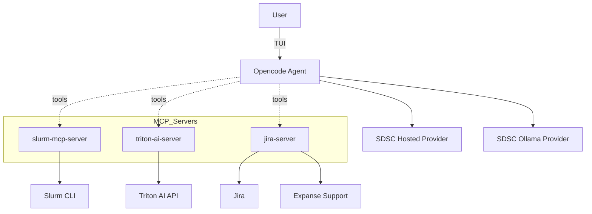

<p align="center">
  
</p>


This directory contains the SDSC deployment of hpcGPT. It integrates Model Context Protocol (MCP) servers for Slurm-based HPC environments, Triton AI documentation Q&A, and support reporting.

## TL;DR - Getting Started

```bash
curl -fsSL https://opencode.ai/install | bash
export OPENCODE_CONFIG=/absolute/path/to/this/repo/SDSC/opencode.jsonc
opencode
```

Set environment variables as needed (see Env section below), then pick a model and use tools from the TUI.

## Features

- Slurm integration (MCP): `accounts`, `sinfo`, `squeue`, and `scontrol` via `slurm-mcp-server`.
- Docs Q&A (MCP): Triton AI tools `query_expanse_documentation`, `query_expanse_ai_documentation`.
- Support reporting (MCP): `send_support_report` via `jira-server`.
- Provider setup: SDSC Hosted provider configured in `opencode.jsonc`.
- Config-driven: Everything wired through `opencode.jsonc` for reproducibility.

## System Architecture



### How things fit together

- Opencode reads `SDSC/opencode.jsonc` for providers, models, and MCP servers.
- MCP servers expose tools over stdio; the agent calls them when the model chooses a tool.
- `slurm-mcp-server` shells out to local Slurm commands.
- `triton-ai-server` calls the Triton AI API to answer questions from Expanse/Expanse AI docs.
- `jira-server` creates Jira support tickets with session context.

## Project Structure

```text
SDSC/
  mcp_servers/
    triton_ai_server/
      server.py
      requirements.txt
    slurm_server/
      server.py
      requirements.txt
    jira_server/
      server.py
      requirements.txt
  prompts/
    support.txt
    report.txt
  opencode.jsonc
  example.env
  doc-scraping/
  README.md
```

## MCP Servers & Tools

- slurm-mcp (local)
  - Tools: `accounts`, `sinfo`, `squeue`, `scontrol`
  - Purpose: query accounts, node/partition status, user jobs, and job details.

- triton-ai-mcp (local)
  - Tools: `query_expanse_documentation`, `query_expanse_ai_documentation`
  - Purpose: answer questions from Expanse and Expanse AI documentation.

- jira-server (local)
  - Tools: `send_support_report`
  - Purpose: create Jira support issues with conversation history and host/user context.

## Installation

Install Opencode and point it at the SDSC config:

```bash
curl -fsSL https://opencode.ai/install | bash
export OPENCODE_CONFIG=/absolute/path/to/this/repo/SDSC/opencode.jsonc
opencode
```

### Optional: Local MCP server setup

MCP servers in `SDSC/mcp_servers/*` are Python services. From each server directory:

```bash
python -m venv .venv
source .venv/bin/activate
pip install -r requirements.txt
python server.py
```

Or run them as configured remote MCP endpoints from the `SDSC/opencode.jsonc` `mcp` section.

## Environment Configuration

Use `SDSC/example.env` as a reference and export values in your shell or `.env`.

### Core variables

- `TRITON_AI_LLM_URL` - Base URL for SDSC Hosted models provider
- Triton AI and report server credentials are configured in each server's `config.json` (see `SDSC/mcp_servers/triton_ai_server/example.config.json` and `SDSC/mcp_servers/jira_server/example.config.json`).

## Usage Examples

Inside the Opencode TUI, pick a model (e.g., `api-gemma-4-26b`) and ask the assistant to use tools.

### Slurm status

"Check the Expanse GPU partitions and my running jobs."

The assistant will call `sinfo` and `squeue` via `slurm-mcp-server`.

### Expanse/Expanse AI docs Q&A

"How do I submit a Slurm job on Expanse?"

The assistant will call `query_expanse_documentation` with your question and return a synthesized answer.

### File a support report

Run the `report` command in Opencode. This uses `send_support_report` to create a Jira support issue with context.

## Configuration Reference

See `SDSC/opencode.jsonc` for providers, models, and MCP server commands. Example provider entries:

```json
{
  "provider": {
    "triton-ai": {
      "npm": "@ai-sdk/openai-compatible",
      "name": "my_provider_name",
      "options": {
        "baseURL": "{env:my_url}"
      },
      "models": {
        "api-gemma-4-26b": {
          "name": "my_model_name",
          "options": {
            "stream": true
          }
        }
      }
    }
  }
}
```

## Links

- Expanse Chatbot: `https://sdsc.chat/Expanse-Documentation` (course: Expanse-Documentation)
- Expanse AI Chatbot: `https://sdsc.chat/ExpanseAI-Documentation` (course: ExpanseAI-Documentation)

## License

MIT - see `../LICENSE`.
